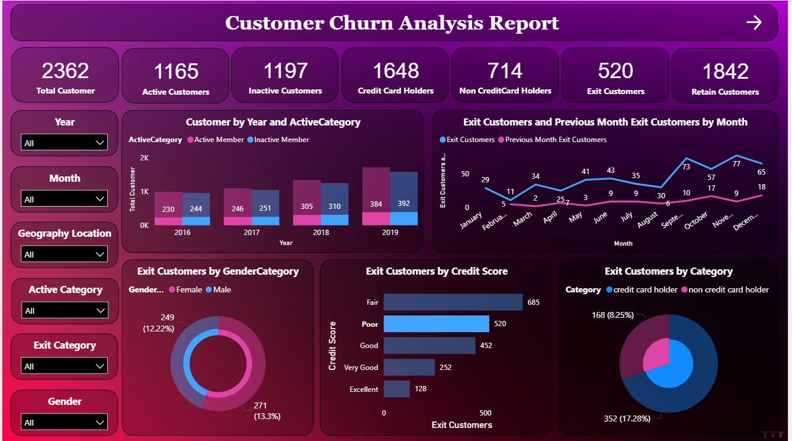

#  Bank Customer Churn Analysis

## Project Overview
This project analyzes bank customer data (10,001 records) to uncover insights into churn behavior, customer demographics, and retention factors.  
It involves data preprocessing in Excel, documentation via BRD, and an **interactive Power BI dashboard** for visualization.  

---

## Project Structure
- **Data/** → Excel & CSV datasets (ActiveCustomer, Bank_Churn, CreditCard, CustomerInfo, ExitCustomer, Gender, Geography).  
- **Documentation/** → Business Requirement Document & Data Dictionary.  
- **Bank_Churn_Analysis.pbix** → Power BI dashboard file with interactive visualizations.  
- **Images/** → Dashboard preview images.  

---

## Objectives
- Identify demographic and financial factors that influence churn.  
- Compare churn across **age groups, geographies, and activity levels**.  
- Analyze relationships between **credit score, tenure, balance, and churn rate**.  
- Build an interactive dashboard to support churn reduction strategies.  

---

## Tools & Technologies
- **Excel** – Data cleaning and preprocessing.  
- **Power BI** – Dashboard creation and visualization.  
- **Word (BRD)** – Business requirements documentation.  

---

## Key Insights
- Customers with **low credit scores** are more likely to churn.  
- **Younger customers** show higher churn rates compared to older customers.  
- **Inactive members** are significantly more likely to exit.  
- Churn rates vary across different **geographies**.  

---

## Dashboard Features
- Churn analysis by **age, gender, geography, and credit score**.  
- KPIs for **total customers, churned customers, and retention rates**.  
- Filters and slicers for interactive exploration.  
- Comparison of churned vs retained customers.  

---

